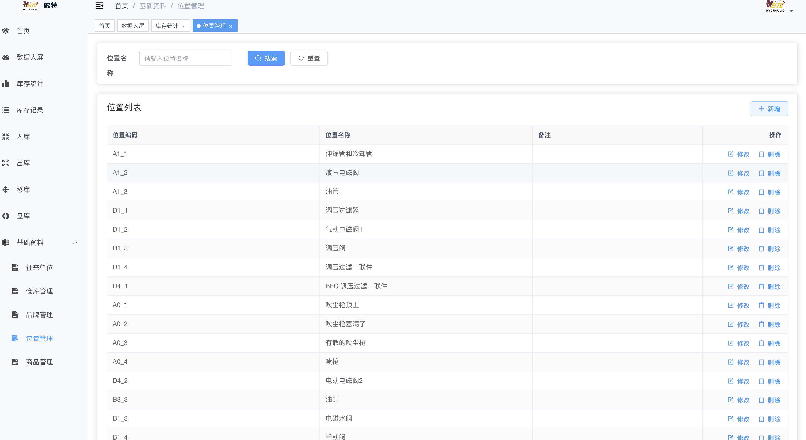
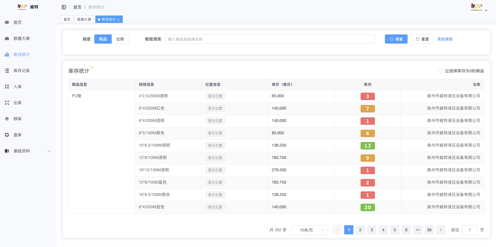

# 威特仓库管理系统
>
> 基于 RuoYi系统 二次开发

## 快速启动

### 启动脚本

- **macOS/Linux**: `./system.sh` 或 `./dev-start.sh`
- **Windows**: `system.bat` 或 `powershell -ExecutionPolicy Bypass -File .\dev-start.ps1`

> 开发时更推荐 `dev-start.sh` / `dev-start.ps1`，它会加载 `backend/.env`，并且按 `Ctrl+C` 会同时关闭前端和后端。
> 前端开发命令统一使用 `pnpm run dev`（默认只绑 `127.0.0.1`，需要从手机等其他设备访问时加 `--host`）。
> **生产环境不要用 `pnpm run dev`** —— vite 开发服务器会通过 `/@fs/` 暴露整个源码树。
> 生产走 `pnpm run build:prod` 产出 `dist`，再用 nginx 或 `pnpm run preview` 托管，
> `start-prod.bat` 已经是这个流程。后端打包必须带 `-Pprod`。

#### 脚本使用说明

`system.sh` 用于启动、停止或查看系统状态：

```bash
./system.sh start   # 启动系统（前后端）
./system.sh stop    # 停止系统
./system.sh status  # 查看系统运行状态
```

#### 日志

- 日志文件存放在 `logs/` 目录下
- 前端日志: `logs/frontend.log`
- 后端日志: `logs/backend.log`

### 访问地址

- 前端: <http://localhost:80>
- 后端: <http://localhost:8080>

## 云服务器部署配置建议

本系统生产部署建议使用 Docker Compose，运行前端 Nginx、Spring Boot 后端、Redis 和数据库备份服务。后端基于 Java 17，默认数据库连接池最大连接数为 20，数据库导入和 Nginx 上传上限约为 520MB。下面的数字是“运行时资源”估算，不是把每个组件简单相加后直接购买同样大小的云主机。

### 各组件资源估算

以少量操作员同时使用、订单量中等、MySQL 与 Redis 和应用部署在同一台服务器为例：

| 组件 | 建议内存 | 建议 CPU | 说明 |
| --- | ---: | ---: | --- |
| Ubuntu、Docker、系统缓存 | 0.7–1GB | 0.2–0.5 核 | 系统本身和文件缓存必须预留，不能全部分配给容器 |
| Nginx 前端 | 0.1–0.25GB | 0.1–0.25 核 | 静态文件和反向代理，资源消耗很小 |
| Spring Boot 后端 | 1.5–2.5GB | 1–2 核 | 主要内存消耗项；包含 JVM、连接池、Excel/图片处理和业务请求 |
| MySQL | 1.5–3GB | 1–2 核 | 取决于数据量、索引、并发查询和 InnoDB 缓存；生产不建议低于 1.5GB |
| Redis | 0.25–0.75GB | 0.1–0.25 核 | 缓存、登录会话和分布式锁；当前不是主要内存消耗项 |
| 数据库备份任务 | 0.1–0.3GB | 0.1–0.5 核 | 备份时会产生 mysqldump 和 gzip 的短时资源峰值 |
| 运行时合计（不含安全余量） | **4.15–7.8GB** | **2.5–5.5 核** | 高峰取决于导入、报表、批量导出和备份是否同时执行 |

这里的 CPU 是峰值估算，不表示每个容器都需要独占对应 CPU。Nginx、Redis 和备份任务大部分时间处于低占用状态；真正需要重点保障的是 Java 后端和 MySQL。内存则不能压得太紧，因为 Linux 文件缓存、JVM 堆外内存和数据库临时排序也需要空间。

### 按组件拆分后的购买建议

#### 方案 A：全部部署在一台云服务器

适合刚上线、用户数量不大、希望成本低且运维简单的情况：

| 组件 | 分配/预留建议 |
| --- | --- |
| Spring Boot 后端 | 2GB 内存，1–2 vCPU；容器默认 `JAVA_OPTS=-XX:MaxRAMPercentage=75`，不建议把 JVM 可用内存压到 1GB 以下 |
| MySQL | 2GB 内存，1–2 vCPU；数据量较大或报表较多时提高到 3–4GB |
| Redis | 512MB 内存，0.25–0.5 vCPU；一般不需要 2GB |
| Nginx | 256MB 内存，0.25 vCPU 足够 |
| 备份任务 | 256–512MB 临时余量；不需要长期独占 CPU |
| 系统和安全余量 | 1–1.5GB 内存，至少 0.5 vCPU |

按上面的拆分，低并发运行时约需要 4.5–5GB 内存，日常推荐购买 **4 vCPU、6GB 内存**；如果包含较多 Excel 导入、图片处理、批量报表或希望高峰期更稳定，购买 **4 vCPU、8GB 内存**。因此并不是所有情况都必须 8GB，8GB 是更宽松的生产建议，不是最低门槛。

#### 方案 B：应用、MySQL、Redis 分开部署

数据重要或希望后续独立扩容时，建议这样拆分：

| 云资源 | 建议配置 | 估算依据 |
| --- | --- | --- |
| 应用服务器 | 2–4 vCPU、3–4GB | Spring Boot 2GB + Nginx 256MB + 系统和余量约 1GB |
| MySQL 托管实例 | 2 vCPU、2–4GB | 2GB 适合中小数据量；查询、报表和数据量增长后升到 4GB |
| Redis 托管实例 | 1 vCPU、512MB–1GB | 当前主要用于缓存、会话和锁，通常不需要大规格 |
| 备份对象存储 | 按备份文件大小计费 | 不占应用服务器长期内存，建议保留至少 7–30 天 |

拆分后各节点合计约为 **5.5–9GB 内存、5–7 个 vCPU 的云资源**，但资源被分散到不同实例，数据库故障、备份峰值或应用升级不会直接挤占同一台机器的全部内存。数据库与 Redis 使用云厂商内网地址配置到 `.env.docker`，不要把生产密码写入 Git。

如果使用本项目 Compose 自带的 MySQL，需要启用 `local-db` profile，并确保 `wms_mysql_data` Docker volume 位于持久化磁盘；云服务器重建或更换实例前必须先验证备份恢复流程。

### 网络与安全

> 公网部署的完整安全说明见 **[docs/security-hardening.md](docs/security-hardening.md)**：
> 已完成的加固项、以及必须由运维完成的事项（HTTPS、凭据轮换、防火墙）。

- 公网只开放 `80` 和 `443`；`22` 仅允许办公网络或固定 IP 访问。
- `8080`、`3306`、`6379` 不应对公网开放。Compose 部署中后端、Redis 默认只在 Docker 网络内通信。
  一旦 `8080` 直接可达，nginx 上的限流和 actuator 拦截会被整个绕过。
- 生产环境应使用域名和 HTTPS，并在云安全组和服务器防火墙中同时限制来源。
  `docker/nginx.conf` 里已备好 443 的完整配置和证书申请命令（注释状态）。
- `.env.docker` 中必须替换 `JWT_SECRET_KEY`、数据库密码和 Redis 密码；密码应使用随机长字符串。
  `JWT_SECRET_KEY` 为空、仍是示例值或短于 32 字符时，应用会直接拒绝启动。
- 后端打包必须使用 `mvn -Pprod`。默认激活的是 `dev` profile，打出来的包会带上
  p6spy、代码生成器，Actuator 也不是生产配置。
- 管理后台、数据库导入和备份功能只授予必要的管理员账号，数据库导入前必须先备份。
- 生产包中不含代码生成器（`tool:gen:*` 相关权限可以直接回收）。

### 磁盘与备份估算

- 单机方案建议 60GB SSD 起步，常规生产建议 100GB；应按“数据库数据 + 附件/OSS 文件 + 日志 + 备份文件”分别估算，不能只看当前数据库大小。
- Compose 默认每天 03:00 备份并保留 7 天。备份文件位于 `wms_backend_backups` volume，建议再复制到对象存储或另一台服务器，避免云主机故障导致备份与业务数据同时丢失。
- 生产环境不要执行 `docker compose down -v`，该命令会删除数据库、Redis 和备份卷。
- 首次构建会同时执行 Maven 和前端 pnpm 构建，内存峰值高于日常运行；建议在 4GB 以上内存的机器上构建，较小实例可在其他机器构建镜像后上传部署，并配置至少 1–2GB swap。

### 配置结论

如果只是验证功能，2 核 4GB 可以运行，但余量较小；如果是低并发正式使用，建议 **4 vCPU、6GB、60GB SSD**；如果包含批量导入导出、图片或报表较多，建议 **4 vCPU、8GB、100GB SSD**。其中比较合理的单机拆分是：后端 2GB、MySQL 2GB、Redis 512MB、Nginx 256MB、系统及高峰余量约 1.5GB。数据量增长后，优先给 MySQL 增加内存或拆分数据库，而不是盲目增加前端容器。

## 新增功能

### 1.位置管理

对于仓库中的货位进行管理，支持货位的增删改查


### 2.部分数字高亮

提高数字的可读性


### 3.新增回车、上下左右键支持

在新增和编辑页面，支持回车键保存和搜索，支持上下左右键切换表格

参考 [RuoYi-WMS](https://github.com/zccbbg/wms-ruoyi)
